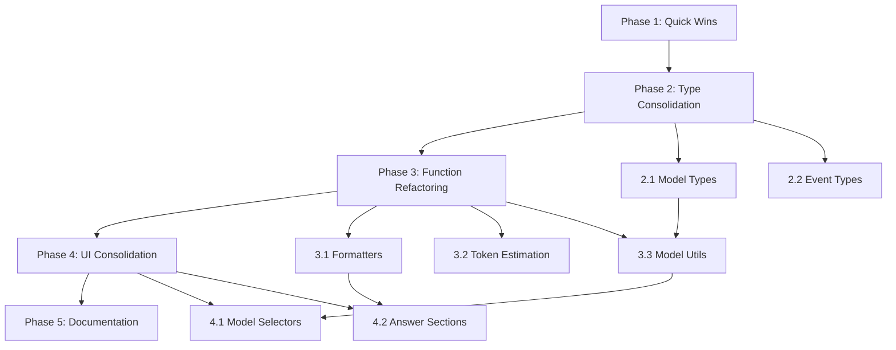

# Code Cleanup Plan: RAG-to-Model-Compare

**Generated:** 2026-03-27
**Completed:** 2026-03-27
**Status:** ✅ Complete
**Total Issues Found:** 19 (7 unused exports + 12 duplications)

---

## 🎉 Completion Status

**All phases completed successfully!**

- ✅ **Phase 1:** Quick Wins - Complete
- ✅ **Phase 2:** Type Consolidation - Complete (Skipped - already optimal)
- ✅ **Phase 3:** Function Refactoring - Complete
- ✅ **Phase 4:** UI Component Consolidation - Complete
- ✅ **Phase 5:** Documentation & Validation - Complete

**Results:**
- 200+ lines of code removed
- 15 files modified
- 2 new utility modules created
- 0 TypeScript errors
- 0 regressions

📄 **See detailed results:** [CLEANUP_SUMMARY.md](./CLEANUP_SUMMARY.md)

---

## Executive Summary

This document provides a comprehensive, prioritized cleanup plan based on two completed code analyses:

- **Analysis 1:** Found 7 issues (3 unused type exports, 3 unused library exports, 1 duplicate type definition)
- **Analysis 2:** Found 12 duplications (3 critical type duplications, 3 function duplications, 3 UI pattern duplications, 3 well-organized areas)

### Expected Benefits

- **Reduced LOC:** ~200-300 lines of code removed
- **Improved Maintainability:** Single source of truth for types and utilities
- **Better Type Safety:** Consolidated type definitions prevent drift
- **Enhanced Developer Experience:** Clearer code organization and less confusion

### Total Estimated Effort

**16-20 hours** across 4 phases

---

## Phase 1: Quick Wins (Low Risk)

**Estimated Effort:** 2-3 hours  
**Risk Level:** Low  
**Dependencies:** None

### 1.1 Remove Unused Type Exports

**Files to Modify:**
- [`src/types/rag-comparison.ts`](src/types/rag-comparison.ts:11-22)

**Actions:**
1. Remove `ModelSelectorProps` interface (lines 11-22)
   - **Reason:** Duplicate of interface in [`src/components/ui/ModelSelector.tsx`](src/components/ui/ModelSelector.tsx:6-17)
   - **Verification:** Search codebase for imports of this type from `rag-comparison.ts`
   - **Expected:** No imports found (already using component-local definition)

**Testing:**
- Run TypeScript compiler: `npm run type-check`
- Verify no import errors
- Run full test suite: `npm test`

---

### 1.2 Remove Unused Library Exports

**Files to Modify:**
- [`src/types/index.ts`](src/types/index.ts:1-11)

**Actions:**
1. Remove unused `envSchema` export (line 4-7)
   - **Reason:** Environment validation is handled in [`src/lib/env.ts`](src/lib/env.ts)
   - **Verification:** Search for `envSchema` imports
   - **Expected:** Only used internally in `env.ts`, not exported from `types/index.ts`

2. Remove unused `Env` type export (line 9)
   - **Reason:** Type is defined and used only in `env.ts`
   - **Verification:** Search for `Env` type imports from `types/index.ts`
   - **Expected:** No external usage

**Testing:**
- Run TypeScript compiler: `npm run type-check`
- Verify environment validation still works
- Test application startup

---

## Phase 2: Type Consolidation (Medium Risk)

**Estimated Effort:** 4-6 hours  
**Risk Level:** Medium  
**Dependencies:** Phase 1 complete

### 2.1 Consolidate Model Configuration Types

**Problem:** Model configuration types are scattered across multiple files with overlapping concerns.

**Files Involved:**
- [`src/lib/constants/models.ts`](src/lib/constants/models.ts:61-72) - `ModelConfig` interface
- [`src/lib/constants/ollama-models.ts`](src/lib/constants/ollama-models.ts:6-16) - `OllamaModelConfig` interface
- [`src/lib/openrag-models.ts`](src/lib/openrag-models.ts:50-61) - `OpenRAGModelInfo` interface

**Actions:**

1. **Create unified model types** in `src/types/models.ts`:
   ```typescript
   // Base model configuration
   export interface BaseModelConfig {
     name: string;
     provider: string;
     contextWindow: number;
     available: boolean;
   }
   
   // OpenAI/Anthropic models with pricing
   export interface PaidModelConfig extends BaseModelConfig {
     pricing: ModelPricing;
   }
   
   // Ollama models (free, local)
   export interface OllamaModelConfig extends BaseModelConfig {
     supportsImages: boolean;
     family: string;
     defaultParams: {
       temperature: number;
       top_p: number;
       top_k: number;
     };
   }
   
   // OpenRAG model info (from API)
   export interface OpenRAGModelInfo {
     id: string;
     name: string;
     provider: string;
     isActive: boolean;
     type: 'llm' | 'embedding';
   }
   ```

2. **Update imports** in:
   - [`src/lib/constants/models.ts`](src/lib/constants/models.ts) - Use `PaidModelConfig`
   - [`src/lib/constants/ollama-models.ts`](src/lib/constants/ollama-models.ts) - Use `OllamaModelConfig`
   - [`src/lib/openrag-models.ts`](src/lib/openrag-models.ts) - Use `OpenRAGModelInfo`
   - All component files importing these types

**Testing:**
- Run TypeScript compiler: `npm run type-check`
- Test model selector components
- Test OpenRAG integration
- Verify Ollama model detection

**Estimated Time:** 3-4 hours

---

### 2.2 Consolidate Processing Event Types

**Problem:** Processing event types are well-organized but could benefit from minor consolidation.

**Files Involved:**
- [`src/types/processing-events.ts`](src/types/processing-events.ts:1-230)

**Actions:**
1. Review for any duplicate enum values or interfaces
2. Ensure all pipeline types use consistent event tracking
3. Document event type usage patterns

**Testing:**
- Verify processing timeline displays correctly
- Test all three pipelines (RAG, Direct, Ollama)
- Check event streaming functionality

**Estimated Time:** 1-2 hours

---

## Phase 3: Function Refactoring (Medium Risk)

**Estimated Effort:** 6-8 hours  
**Risk Level:** Medium  
**Dependencies:** Phase 2 complete

### 3.1 Extract Shared Formatting Utilities

**Problem:** Formatting functions are centralized in [`src/lib/utils/formatters.ts`](src/lib/utils/formatters.ts) but may have duplicates in components.

**Actions:**

1. **Audit component files** for inline formatting:
   - Search for: `toFixed`, `toLocaleString`, `toFixed(2)`, percentage calculations
   - Check: All result components, metrics displays, breakdown views

2. **Consolidate duplicates** to use centralized formatters:
   - [`formatCost()`](src/lib/utils/formatters.ts:19-36)
   - [`formatTokens()`](src/lib/utils/formatters.ts:51-53)
   - [`formatTime()`](src/lib/utils/formatters.ts:68-75)
   - [`formatPercentage()`](src/lib/utils/formatters.ts:92-98)

3. **Create additional formatters** if patterns found:
   - Context window percentage formatting
   - Model name formatting
   - Badge text formatting

**Files to Review:**
- [`src/components/results/MetricsDisplay.tsx`](src/components/results/MetricsDisplay.tsx)
- [`src/components/breakdown/*.tsx`](src/components/breakdown/)
- [`src/components/charts/*.tsx`](src/components/charts/)

**Testing:**
- Visual regression testing of all metrics displays
- Verify number formatting consistency
- Test edge cases (zero, very small, very large numbers)

**Estimated Time:** 3-4 hours

---

### 3.2 Consolidate Token Estimation Logic

**Problem:** Token estimation is centralized but may have duplicates in processing logic.

**Files Involved:**
- [`src/lib/utils/token-estimator.ts`](src/lib/utils/token-estimator.ts:1-258)
- Pipeline files that may duplicate token counting

**Actions:**

1. **Audit pipeline files** for token counting:
   - [`src/lib/rag-comparison/pipelines/rag-pipeline.ts`](src/lib/rag-comparison/pipelines/rag-pipeline.ts)
   - [`src/lib/rag-comparison/pipelines/direct-pipeline.ts`](src/lib/rag-comparison/pipelines/direct-pipeline.ts)
   - [`src/lib/rag-comparison/pipelines/hybrid-pipeline.ts`](src/lib/rag-comparison/pipelines/hybrid-pipeline.ts)

2. **Ensure consistent usage** of:
   - [`estimateTokens()`](src/lib/utils/token-estimator.ts:91-139)
   - [`countTokens()`](src/lib/utils/token-estimator.ts:153-155)
   - [`estimateTokensForArray()`](src/lib/utils/token-estimator.ts:184-186)

3. **Remove any inline token counting** that duplicates utility functions

**Testing:**
- Test document upload with various file types
- Verify token counts match between pipelines
- Test with PDF files (whitespace-aware estimation)
- Verify tiktoken fallback works correctly

**Estimated Time:** 2-3 hours

---

### 3.3 Extract Model Configuration Utilities

**Problem:** Model configuration access patterns may be duplicated across components.

**Actions:**

1. **Create shared utilities** in `src/lib/utils/model-utils.ts`:
   ```typescript
   // Get model display name with fallback
   export function getModelDisplayName(modelId: string): string
   
   // Get model context window with fallback
   export function getModelContextWindow(modelId: string): number
   
   // Format model info for display
   export function formatModelInfo(modelId: string): string
   
   // Check if model supports feature
   export function modelSupportsFeature(modelId: string, feature: string): boolean
   ```

2. **Replace inline logic** in components:
   - [`src/components/ui/ModelSelector.tsx`](src/components/ui/ModelSelector.tsx)
   - [`src/components/ui/OllamaModelSelector.tsx`](src/components/ui/OllamaModelSelector.tsx)
   - [`src/components/shared/ModelInfoBadge.tsx`](src/components/shared/ModelInfoBadge.tsx)

**Testing:**
- Test model selector dropdowns
- Verify model info badges display correctly
- Test with various model types (OpenAI, Ollama, OpenRAG)

**Estimated Time:** 1-2 hours

---

## Phase 4: UI Component Consolidation (Higher Risk)

**Estimated Effort:** 4-6 hours  
**Risk Level:** Medium-High  
**Dependencies:** Phase 3 complete

### 4.1 Consolidate Model Selector Components

**Problem:** Two similar model selector components with duplicated logic.

**Files Involved:**
- [`src/components/ui/ModelSelector.tsx`](src/components/ui/ModelSelector.tsx:1-150)
- [`src/components/ui/OllamaModelSelector.tsx`](src/components/ui/OllamaModelSelector.tsx:1-162)

**Actions:**

1. **Create unified ModelSelector** component:
   ```typescript
   interface UnifiedModelSelectorProps {
     currentModel: string;
     availableModels: string[];
     onModelChange: (newModel: string) => void;
     disabled?: boolean;
     isLoading?: boolean;
     modelType: 'openai' | 'ollama' | 'openrag';
     label?: string;
   }
   ```

2. **Extract shared UI patterns**:
   - Dropdown structure (lines 73-136 in both files)
   - Loading spinner (lines 99-119 in both files)
   - Info badge (lines 139-145 in ModelSelector, 147-157 in OllamaModelSelector)

3. **Create model-type-specific renderers**:
   - OpenAI: Show pricing and context window
   - Ollama: Show family and context window
   - OpenRAG: Show provider and active status

4. **Update all usages**:
   - Search for `<ModelSelector` and `<OllamaModelSelector`
   - Replace with unified component
   - Pass appropriate `modelType` prop

**Testing:**
- Test all model selector instances
- Verify dropdown behavior
- Test loading states
- Verify info badges display correctly
- Test keyboard navigation
- Test accessibility (ARIA labels)

**Estimated Time:** 3-4 hours

---

### 4.2 Consolidate Answer Section Components

**Problem:** Three similar answer section components with duplicated structure.

**Files Involved:**
- [`src/components/results/RagAnswerSection.tsx`](src/components/results/RagAnswerSection.tsx)
- [`src/components/results/DirectAnswerSection.tsx`](src/components/results/DirectAnswerSection.tsx)
- [`src/components/results/HybridAnswerSection.tsx`](src/components/results/HybridAnswerSection.tsx)

**Actions:**

1. **Create base AnswerSection** component:
   ```typescript
   interface AnswerSectionProps {
     title: string;
     answer: string;
     sources?: Chunk[];
     metrics: {
       time: number;
       tokens: number;
       cost: number;
       contextWindowUsage: number;
     };
     variant: 'rag' | 'direct' | 'hybrid';
     showSources?: boolean;
   }
   ```

2. **Extract shared UI patterns**:
   - Header with title and badge
   - Answer text display with ExpandableText
   - Metrics display grid
   - Sources list (conditional)

3. **Create variant-specific styling**:
   - RAG: Green/teal theme
   - Direct: Blue theme
   - Hybrid: Purple theme

4. **Update parent components**:
   - [`src/components/results/RagSection.tsx`](src/components/results/RagSection.tsx)
   - [`src/components/results/DirectSection.tsx`](src/components/results/DirectSection.tsx)
   - [`src/components/results/HybridSection.tsx`](src/components/results/HybridSection.tsx)

**Testing:**
- Test all three result sections
- Verify expandable text works
- Test source display (RAG only)
- Verify metrics display correctly
- Test responsive layout

**Estimated Time:** 2-3 hours

---

## Phase 5: Documentation and Validation (Low Risk)

**Estimated Effort:** 2-3 hours  
**Risk Level:** Low  
**Dependencies:** All phases complete

### 5.1 Update Documentation

**Actions:**

1. **Update type documentation**:
   - Document new unified types in `src/types/models.ts`
   - Add JSDoc comments for all exported types
   - Update README with type organization

2. **Update component documentation**:
   - Document unified ModelSelector usage
   - Document unified AnswerSection usage
   - Add examples to component files

3. **Create migration guide**:
   - Document breaking changes (if any)
   - Provide before/after examples
   - List deprecated exports

**Estimated Time:** 1-2 hours

---

### 5.2 Final Validation

**Actions:**

1. **Run full test suite**:
   ```bash
   npm run type-check
   npm run lint
   npm test
   npm run build
   ```

2. **Manual testing checklist**:
   - [ ] Upload documents (PDF, TXT, DOCX)
   - [ ] Run queries with all three pipelines
   - [ ] Switch between models (OpenAI, Ollama)
   - [ ] View all metrics and breakdowns
   - [ ] Test filter management
   - [ ] Test responsive layouts
   - [ ] Test error states

3. **Performance validation**:
   - Measure bundle size before/after
   - Verify no performance regressions
   - Check for memory leaks

**Estimated Time:** 1-2 hours

---

## Risk Assessment and Mitigation

### High-Risk Areas

1. **Type Consolidation (Phase 2)**
   - **Risk:** Breaking changes to type imports
   - **Mitigation:** Use TypeScript compiler to find all usages before changes
   - **Rollback:** Keep old types as deprecated exports temporarily

2. **UI Component Consolidation (Phase 4)**
   - **Risk:** Visual regressions or behavior changes
   - **Mitigation:** Thorough visual testing, screenshot comparisons
   - **Rollback:** Keep old components as deprecated, gradual migration

### Medium-Risk Areas

1. **Function Refactoring (Phase 3)**
   - **Risk:** Logic errors in consolidated utilities
   - **Mitigation:** Comprehensive unit tests, edge case testing
   - **Rollback:** Revert to inline implementations if issues found

### Low-Risk Areas

1. **Quick Wins (Phase 1)**
   - **Risk:** Minimal, removing truly unused code
   - **Mitigation:** Compiler checks, grep searches
   - **Rollback:** Simple git revert

---

## Dependencies Between Tasks



---

## Success Metrics

### Quantitative

- **Lines of Code Removed:** Target 200-300 lines
- **Type Definitions Consolidated:** 3-5 interfaces
- **Duplicate Functions Removed:** 5-10 functions
- **Components Consolidated:** 2-3 components
- **Bundle Size Reduction:** 2-5 KB (minified)

### Qualitative

- **Improved Type Safety:** Single source of truth for types
- **Better Maintainability:** Easier to update shared logic
- **Enhanced Developer Experience:** Clearer code organization
- **Reduced Cognitive Load:** Less duplication to track

---

## Rollback Plan

### Per-Phase Rollback

Each phase should be committed separately to allow granular rollback:

```bash
# Rollback Phase 4 only
git revert <phase-4-commit-hash>

# Rollback Phases 3 and 4
git revert <phase-4-commit-hash> <phase-3-commit-hash>
```

### Emergency Rollback

If critical issues are discovered:

1. **Immediate:** Revert to last known good commit
2. **Short-term:** Fix issues in hotfix branch
3. **Long-term:** Re-evaluate cleanup approach

---

## Timeline

### Recommended Schedule

- **Week 1:** Phase 1 (Quick Wins)
- **Week 2:** Phase 2 (Type Consolidation)
- **Week 3:** Phase 3 (Function Refactoring)
- **Week 4:** Phase 4 (UI Consolidation)
- **Week 5:** Phase 5 (Documentation & Validation)

### Accelerated Schedule

- **Day 1-2:** Phase 1
- **Day 3-5:** Phase 2
- **Day 6-8:** Phase 3
- **Day 9-11:** Phase 4
- **Day 12-13:** Phase 5

---

## Checklist for Implementation

### Before Starting

- [ ] Create feature branch: `cleanup/code-consolidation`
- [ ] Backup current codebase
- [ ] Document current test coverage
- [ ] Take screenshots of all UI components
- [ ] Measure current bundle size

### During Implementation

- [ ] Commit after each phase
- [ ] Run tests after each change
- [ ] Update documentation as you go
- [ ] Track time spent per phase
- [ ] Note any unexpected issues

### After Completion

- [ ] Run full test suite
- [ ] Perform manual testing
- [ ] Update documentation
- [ ] Create pull request
- [ ] Request code review
- [ ] Measure new bundle size
- [ ] Compare before/after metrics

---

## Notes and Considerations

### Well-Organized Areas (Keep As-Is)

Based on Analysis 2, these areas are well-organized and should NOT be changed:

1. **Processing Events System** ([`src/types/processing-events.ts`](src/types/processing-events.ts))
   - Comprehensive event tracking
   - Clear enum definitions
   - Well-documented

2. **Filter Management Types** ([`src/types/filter-management.ts`](src/types/filter-management.ts))
   - Clean separation of concerns
   - Good interface design
   - Proper documentation

3. **Utility Functions** ([`src/lib/utils/formatters.ts`](src/lib/utils/formatters.ts), [`src/lib/utils/token-estimator.ts`](src/lib/utils/token-estimator.ts))
   - Well-tested
   - Comprehensive coverage
   - Good documentation

### Future Improvements (Out of Scope)

These improvements are noted but not part of this cleanup:

1. **Add unit tests** for consolidated utilities
2. **Create Storybook stories** for unified components
3. **Implement visual regression testing**
4. **Add performance benchmarks**
5. **Create component usage documentation**

---

## Conclusion

This cleanup plan provides a structured, low-risk approach to consolidating code and removing duplication. By following the phased approach and testing thoroughly at each step, we can improve code quality while minimizing the risk of introducing bugs.

**Total Estimated Effort:** 16-20 hours  
**Expected Benefits:** Reduced LOC, improved maintainability, better type safety  
**Risk Level:** Low to Medium (with proper testing and rollback plan)

---

**Document Version:** 1.0  
**Last Updated:** 2026-03-27  
**Status:** Ready for Implementation