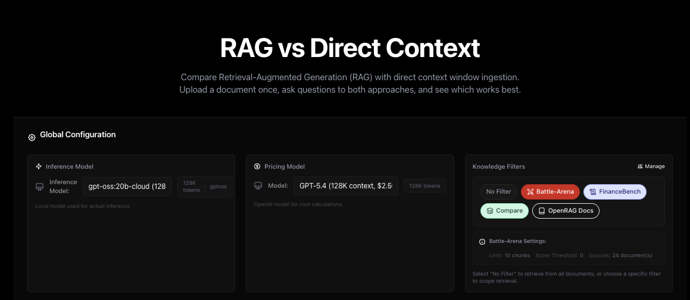
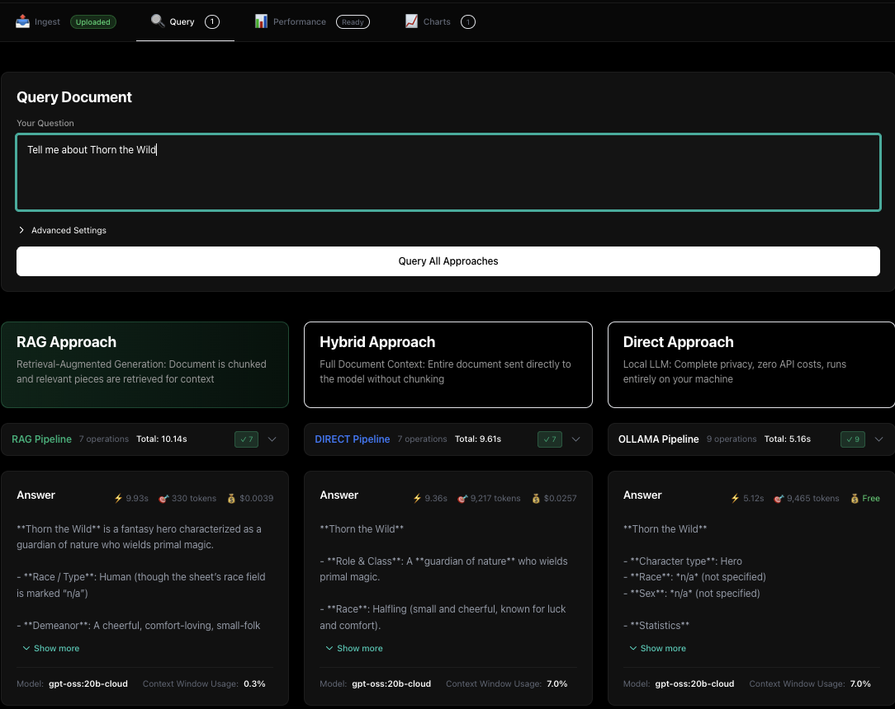
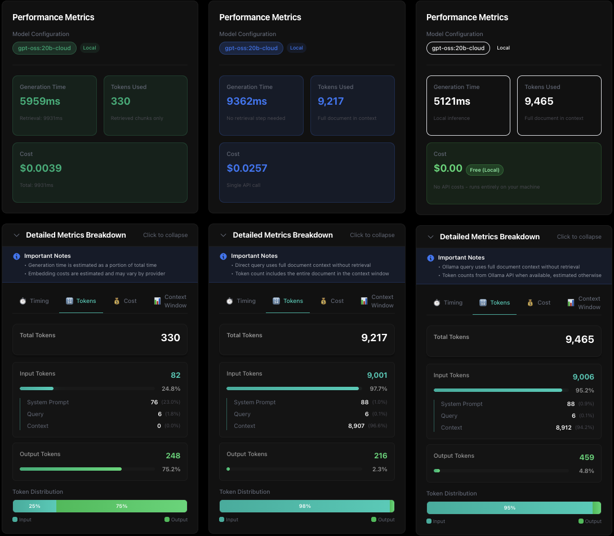

# RAG vs Direct Context Comparison Tool

<div align="center">





</div>

A Next.js application for comparing **RAG (Retrieval-Augmented Generation)** with **Direct Context Window** approaches. Compare response quality, token usage, costs, and performance across different document processing strategies.

## ⚠️ Prerequisites

Before you begin, ensure you have:

1. **[OpenRAG](https://www.openr.ag/) Server** - Running and accessible with API key
2. **[Ollama](https://ollama.ai/)** - Installed and running locally
3. **[Node.js](https://nodejs.org/)** 18.x or later

All three are **required** for the comparison to work.

## 🎯 What This Tool Does

Compare three approaches to document-based question answering:

1. **RAG**: [OpenRAG](https://www.openr.ag/) retrieves relevant chunks, then generates answer
2. **Hybrid**: [OpenRAG](https://www.openr.ag/) generates answer using full document context
3. **Direct**: [Ollama](https://ollama.ai/) generates answer using full document context (local inference)

Get detailed metrics on tokens, costs, timing, and context window usage for each approach.

## ✨ Key Features

### 📑 Tabbed Interface
- **Ingest Tab**: Upload documents and configure models
- **Query Tab**: Ask questions and see three-column comparison (RAG | Hybrid | Direct)
- **Performance Tab**: Review query history and detailed metrics

### 🎨 Visual Filter Management
- Create and manage [OpenRAG](https://www.openr.ag/) knowledge filters
- Color-coded filter badges
- Filter documents by topic, project, or category
- Persistent filter selection across sessions

### 🤖 Model Configuration
- **Inference Model**: Select [Ollama](https://ollama.ai/) model for local generation (required)
- **Knowledge Filter**: Choose which documents to query in [OpenRAG](https://www.openr.ag/)
- **Pricing Model**: Pick OpenAI model for comparative cost calculations

### 📊 Comprehensive Metrics
- **Token Usage**: Input/output breakdown per approach
- **Cost Analysis**: Real-time pricing based on model rates
- **Performance**: Retrieval time, generation time, total time
- **Context Window**: Percentage utilization tracking
- **Processing Timeline**: Event-by-event execution tracking

## 🚀 Quick Start

### Required Services

You must have all three services running:

1. **[OpenRAG](https://www.openr.ag/) Server**
   - Install: `uvx openrag`
   - Follow the [OpenRAG installation guide](https://docs.openr.ag/install-uvx)
   - Get your API key from OpenRAG settings

2. **[Ollama](https://ollama.ai/)**
   - Install from [ollama.ai](https://ollama.ai/)
   - Start [Ollama](https://ollama.ai/) service
   - Pull at least one model: `ollama pull gpt-oss:20b`

3. **[Node.js](https://nodejs.org/)**
   - Version 18.x or later
   - Verify: `node --version`

### Installation

```bash
# Install dependencies
npm install

# Configure environment
cp .env.example .env.local
```

Edit `.env.local`:

```env
# OpenRAG Server Configuration
OPENRAG_URL=http://localhost:3000
OPENRAG_API_KEY=your_api_key_here

# Ollama Configuration
OLLAMA_BASE_URL=http://localhost:11434
OLLAMA_DEFAULT_MODEL=gpt-oss:20b
OLLAMA_TIMEOUT=120000
```

### Run Development Server

```bash
npm run dev
```

Open [http://localhost:3020](http://localhost:3020) (or your configured port)

### Production Build

```bash
npm run build
npm start
```

## 📖 How to Use

### 1. Configure Models (Global Config Bar)
- **Inference Model**: Select Ollama model for generation
- **Knowledge Filter**: Choose filter or create new one
- **Pricing Model**: Pick model for cost calculations

### 2. Upload Documents (Ingest Tab)
- Drag & drop or browse for files
- Supported: TXT, MD, PDF, DOCX, DOC
- Documents processed in parallel (RAG + Direct)
- View processing results and statistics

### 3. Ask Questions (Query Tab)
- Enter your question
- See three-column comparison:
  - **RAG**: Uses [OpenRAG](https://www.openr.ag/) to search documents for relevant sections, then generates an answer using only those chunks
  - **Hybrid**: Uses [OpenRAG](https://www.openr.ag/) direct-context to send your entire document for context-aware answers, falls back to RAG when data not available in context
  - **Direct**: Uses [Ollama](https://ollama.ai/) API to inject your complete dataset into the context window for whole document inference

### 4. Analyze Performance (Performance Tab)
- Review last 10 queries
- Compare speed, tokens, and costs
- View detailed metric breakdowns
- Replay previous queries

## 🛠️ Technology Stack

### Document Processing
- **[pdf-parse](https://www.npmjs.com/package/pdf-parse)** - PDF text extraction
- **[mammoth](https://www.npmjs.com/package/mammoth)** - DOCX text extraction
- **[canvas](https://www.npmjs.com/package/canvas)** - PDF rendering support

### AI & RAG
- **[OpenRAG SDK](https://www.openr.ag/) 0.2.2** - RAG functionality
- **[js-tiktoken](https://www.npmjs.com/package/js-tiktoken)** - Token counting
- **[Zod](https://zod.dev/)** - Schema validation

## 📊 Supported Models

### [OpenAI Models](https://platform.openai.com/docs/pricing) (for cost calculations)
**GPT-5 Series** (128K context)
- GPT-5.4, GPT-5.4 Pro
- GPT-5, GPT-5 Mini, GPT-5 Nano

**GPT-4 Series** (128K context)
- GPT-4.1, GPT-4.1 Mini, GPT-4.1 Nano
- GPT-4o, GPT-4o Mini
- GPT-4 Turbo, GPT-4

*Pricing data sourced from [OpenAI's official pricing page](https://platform.openai.com/docs/pricing)*

### [Ollama](https://ollama.ai/) Models (local inference)
- Auto-detected from your [Ollama](https://ollama.ai/) installation
- Supports all [Ollama](https://ollama.ai/)-compatible models
- Zero API costs

## 🎓 When to Use Each Approach

### RAG (Retrieval-Augmented Generation)
**Best for:**
- Large document sets and knowledge bases
- Searching across multiple documents
- Documents exceeding context windows
- Documents frequently updated
- Cost efficiency: only relevant chunks processed, much less tokens used
- Pay token cost upfront for indexing, then costs diminish over time
- Automatic format handling via [OpenRAG](https://www.openr.ag/) and Docling

**Trade-offs:**
- May miss context outside retrieved chunks
- May be slower than direct context for smaller documents

### Hybrid (Full Context via OpenRAG)
**Best for:**
- Small to medium documents that fit in context
- Need entire document for comprehensive answers
- Document structure/relationships are important
- Want [OpenRAG](https://www.openr.ag/)'s processing with full context
- Falls back to RAG when document exceeds context limits

**Trade-offs:**
- Higher token costs than RAG (entire document processed)

### Direct (Full Context)
**Best for:**
- Maximum accuracy - entire document in context
- Fast inference - no retrieval overhead
- Smaller documents within context limits
- Baseline comparison against RAG approaches

**Trade-offs:**
- Higher token costs (pay on every ingest/query)
- Hard limit on document size (context window)
- Performnce and accuracy can degrade when pushing past effective context
- Not shared across users

## 🤝 Contributing

Contributions welcome! Please:

1. Fork the repository
2. Create a feature branch
3. Add tests for new features
4. Ensure type checking passes
5. Submit a pull request

## 📄 License

MIT License - see LICENSE file for details