# RAG Pipeline Architecture: No Document Parsing

## ⚠️ CRITICAL RULE

**The RAG pipeline must NEVER parse documents. This is a recurring regression that has been fixed multiple times.**

## Overview

This document exists because document parsing code keeps being added to the RAG pipeline, causing browser API errors and degrading performance. This is a **critical architectural constraint** that must be understood and followed.

## The Rule

### ❌ NEVER DO THIS in RAG Pipeline

```typescript
// ❌ WRONG - Do NOT import parseDocument in rag-pipeline.ts
import { parseDocument } from '@/lib/rag-comparison/processing/document-processor';

// ❌ WRONG - Do NOT parse documents before sending to OpenRAG
const { content } = await parseDocument(file);
await client.documents.ingest({ file: content, ... });

// ❌ WRONG - Do NOT try to count tokens by parsing
const { content } = await parseDocument(file);
const tokenCount = estimateTokens(content);
```

### ✅ ALWAYS DO THIS in RAG Pipeline

```typescript
// ✅ RIGHT - Send raw file directly to OpenRAG SDK
const result = await client.documents.ingest({
  file,  // Raw File object - no parsing!
  filename: path.basename(metadata.filename),
  wait: true,
});

// ✅ RIGHT - Token counts come from OpenRAG's response
// OpenRAG handles parsing internally and returns metadata
const tokenCount = 0; // Placeholder - OpenRAG provides this
```

## Why This Rule Exists

### Technical Explanation

1. **OpenRAG SDK handles ALL parsing internally**
   - OpenRAG has sophisticated document parsing built-in
   - It handles PDF, DOCX, TXT, MD, and other formats
   - It extracts text, tables, images, and metadata
   - It performs chunking and embedding automatically

2. **Parsing in Node.js triggers browser API dependencies**
   - The `pdf-parse` library depends on `pdfjs-dist`
   - `pdfjs-dist` is designed for browsers and uses browser APIs
   - When imported in Node.js, it causes errors like:
     ```
     ReferenceError: document is not defined
     ReferenceError: Image is not defined
     ReferenceError: HTMLCanvasElement is not defined
     ```

3. **It's redundant and degrades performance**
   - Parsing the document twice (once in Node.js, once in OpenRAG) wastes CPU
   - Increases memory usage unnecessarily
   - Adds latency to the upload process
   - Provides no benefit since OpenRAG does it better

## Architecture Diagram

```mermaid
graph TB
    subgraph "✅ CORRECT: RAG Pipeline"
        A1[User uploads file] --> B1[Upload API receives File]
        B1 --> C1[RAG Pipeline: indexDocument]
        C1 --> D1[Send raw File to OpenRAG SDK]
        D1 --> E1[OpenRAG SDK handles parsing internally]
        E1 --> F1[OpenRAG returns success + metadata]
    end

    subgraph "❌ INCORRECT: RAG Pipeline with Parsing"
        A2[User uploads file] --> B2[Upload API receives File]
        B2 --> C2[RAG Pipeline: indexDocument]
        C2 --> D2[parseDocument called]
        D2 --> E2[pdf-parse/pdfjs-dist loaded]
        E2 --> F2[💥 Browser API errors]
        F2 --> G2[document is not defined]
        F2 --> H2[Image is not defined]
    end

    subgraph "✅ CORRECT: Direct/Ollama Pipeline"
        A3[User uploads file] --> B3[Upload API receives File]
        B3 --> C3[parseDocument called]
        C3 --> D3[Extract text content]
        D3 --> E3[Direct Pipeline: loadDocument]
        E3 --> F3[Store full text in memory]
        F3 --> G3[Query with full context]
    end
```



## Code Examples

### ❌ WRONG: What NOT to Do

This is the code that keeps being added and must be avoided:

```typescript
// In rag-pipeline.ts - ❌ WRONG
import { parseDocument } from '@/lib/rag-comparison/processing/document-processor';

export async function indexDocument(
  file: File,
  documentId: string,
  metadata: DocumentMetadata
): Promise<IndexResult> {
  // ❌ WRONG - Do NOT parse the document
  const { content, parsingRequired } = await parseDocument(file);
  
  // ❌ WRONG - Do NOT count tokens from parsed content
  const tokenCount = estimateTokens(content);
  
  // ❌ WRONG - Do NOT send parsed content to OpenRAG
  const result = await client.documents.ingest({
    file: content,  // Wrong! Send raw file, not parsed content
    filename: metadata.filename,
    wait: true,
  });
  
  return {
    success: true,
    documentId,
    tokenCount,  // Wrong! This should come from OpenRAG
    // ...
  };
}
```

### ✅ RIGHT: Correct Approach

This is the correct implementation (from [`rag-pipeline.ts:403-638`](src/lib/rag-comparison/pipelines/rag-pipeline.ts:403-638)):

```typescript
// In rag-pipeline.ts - ✅ RIGHT
// NO import of parseDocument - not needed!

export async function indexDocument(
  file: File,
  documentId: string,
  metadata: DocumentMetadata,
  knowledgeFilterId?: string,
  skipFilterUpdate: boolean = false
): Promise<IndexResult> {
  const startTime = performance.now();

  try {
    // Validate inputs
    validateDocumentId(documentId, RAGPipelineError);

    if (!file || !(file instanceof File)) {
      throw new RAGPipelineError(
        'Valid file is required',
        'INVALID_FILE',
        { documentId, file: typeof file }
      );
    }

    // ✅ RIGHT - Token count will come from OpenRAG's response
    // OpenRAG SDK handles all document parsing internally
    const tokenCount = 0; // Placeholder - will be updated from ingestion result

    // Get OpenRAG client
    const client = getOpenRAGClient(RAGPipelineError);

    // ✅ RIGHT - Send raw file directly to OpenRAG SDK
    // The SDK handles parsing, chunking, and embedding automatically
    const result = await client.documents.ingest({
      file,  // Raw File object - no parsing!
      filename: path.basename(metadata.filename),
      wait: true, // Wait for ingestion to complete
    });

    // Check if ingestion was successful
    const taskStatus = result as any;
    
    if (taskStatus.status !== 'completed') {
      throw new RAGPipelineError(
        `Document ingestion failed with status: ${taskStatus.status}`,
        'INGESTION_ERROR',
        {
          documentId,
          status: taskStatus.status,
          failedFiles: taskStatus.failed_files,
        }
      );
    }

    // ✅ RIGHT - Use successful_files count as chunk estimate
    const chunkCount = taskStatus.successful_files || 1;

    return {
      success: true,
      documentId,
      filterId: knowledgeFilterId,
      chunkCount,
      tokenCount,  // From OpenRAG response (currently 0, could be enhanced)
      indexTime: Math.round(performance.now() - startTime)
    };

  } catch (error) {
    // Error handling...
  }
}
```

### ✅ RIGHT: Direct Pipeline (Parsing IS Needed)

For comparison, here's where parsing IS correct (from [`direct-pipeline.ts:360-476`](src/lib/rag-comparison/pipelines/direct-pipeline.ts:360-476)):

```typescript
// In direct-pipeline.ts - ✅ RIGHT to parse here
import { parseDocument } from '@/lib/rag-comparison/processing/document-processor';

export async function loadDocument(
  content: string,  // Already parsed content
  documentId: string,
  metadata: DocumentMetadata,
  isMultiFile: boolean = false,
  filename?: string
): Promise<LoadResult> {
  // ✅ RIGHT - Direct pipeline needs parsed content
  // because it stores full text in memory for querying
  
  const sanitizedContent = sanitizeInput(content);
  const tokenCount = estimateTokens(sanitizedContent);
  
  // Store in memory for later querying
  // ...
}
```

## Historical Context

This regression has occurred multiple times:

1. **Initial Implementation** - Correctly implemented without parsing
2. **First Regression** - Parsing added to "count tokens before upload"
   - Fixed by removing parsing and using OpenRAG's response
3. **Second Regression** - Parsing added to "show content preview"
   - Fixed by using OpenRAG's query API instead
4. **Third Regression** - Parsing added to "validate file content"
   - Fixed by relying on OpenRAG's validation

### Why Developers Keep Adding It

Common reasons developers add parsing to RAG pipeline:

1. **Token Counting** - "I need to know token count before upload"
   - ✅ Solution: Get token count from OpenRAG's response after ingestion
   - ✅ Alternative: Use file size estimation (1 token ≈ 4 characters)

2. **Content Preview** - "I want to show a preview of the document"
   - ✅ Solution: Use OpenRAG's query API to retrieve content
   - ✅ Alternative: Show filename and metadata only

3. **Validation** - "I need to validate the document is readable"
   - ✅ Solution: Let OpenRAG validate during ingestion
   - ✅ Alternative: Validate file type and size only

4. **Consistency** - "Direct pipeline parses, so RAG should too"
   - ❌ Wrong: Different pipelines have different architectures
   - ✅ Right: RAG delegates to OpenRAG, Direct handles locally

## Alternative Solutions

### If You Need Token Counts

```typescript
// ❌ WRONG
const { content } = await parseDocument(file);
const tokenCount = estimateTokens(content);

// ✅ RIGHT - Option 1: Get from OpenRAG response
const result = await client.documents.ingest({ file, ... });
// OpenRAG could return token count in future (currently doesn't)

// ✅ RIGHT - Option 2: Estimate from file size
const estimatedTokens = Math.ceil(file.size / 4); // Rough estimate
```

### If You Need Content Preview

```typescript
// ❌ WRONG
const { content } = await parseDocument(file);
const preview = content.substring(0, 500);

// ✅ RIGHT - Query OpenRAG after ingestion
const response = await client.chat.create({
  message: "Summarize this document in 2-3 sentences",
  filterId: filterId,
  limit: 3
});
const preview = response.response;
```

### If You Need to Validate Content

```typescript
// ❌ WRONG
const { content } = await parseDocument(file);
if (!content || content.length === 0) {
  throw new Error('Empty document');
}

// ✅ RIGHT - Let OpenRAG validate
const result = await client.documents.ingest({ file, ... });
if (result.status !== 'completed') {
  throw new Error('Document ingestion failed');
}
```

## Testing Requirements

A test file should be created to prevent this regression:

**File**: `src/__tests__/rag-pipeline-no-parsing.test.ts`

```typescript
import { describe, it, expect } from '@jest/globals';
import * as fs from 'fs';
import * as path from 'path';

describe('RAG Pipeline - No Parsing Constraint', () => {
  it('should not import parseDocument in rag-pipeline.ts', () => {
    const ragPipelinePath = path.join(__dirname, '../lib/rag-comparison/pipelines/rag-pipeline.ts');
    const content = fs.readFileSync(ragPipelinePath, 'utf-8');
    
    // Check for parseDocument import
    expect(content).not.toMatch(/import.*parseDocument.*from.*document-processor/);
    expect(content).not.toMatch(/require.*document-processor/);
  });

  it('should not call parseDocument in rag-pipeline.ts', () => {
    const ragPipelinePath = path.join(__dirname, '../lib/rag-comparison/pipelines/rag-pipeline.ts');
    const content = fs.readFileSync(ragPipelinePath, 'utf-8');
    
    // Check for parseDocument calls
    expect(content).not.toMatch(/parseDocument\s*\(/);
    expect(content).not.toMatch(/await\s+parseDocument/);
  });

  it('should send raw file to OpenRAG SDK', () => {
    const ragPipelinePath = path.join(__dirname, '../lib/rag-comparison/pipelines/rag-pipeline.ts');
    const content = fs.readFileSync(ragPipelinePath, 'utf-8');
    
    // Verify correct pattern: client.documents.ingest({ file, ... })
    expect(content).toMatch(/client\.documents\.ingest\s*\(\s*\{[^}]*file[^}]*\}\s*\)/);
  });
});
```

## Related Files

### RAG Pipeline (NO parsing)
- [`src/lib/rag-comparison/pipelines/rag-pipeline.ts`](src/lib/rag-comparison/pipelines/rag-pipeline.ts) - Main RAG pipeline implementation
  - **MUST NOT** import or use `parseDocument`
  - **MUST** send raw `File` objects to OpenRAG SDK
  - **MUST NOT** parse documents for token counting

### Direct/Ollama Pipeline (parsing IS needed)
- [`src/lib/rag-comparison/pipelines/direct-pipeline.ts`](src/lib/rag-comparison/pipelines/direct-pipeline.ts) - Direct pipeline implementation
  - **SHOULD** use parsed content (receives it from upload route)
  - Stores full document text in memory
  - Queries with complete context

### Document Processor (only for Direct pipeline)
- [`src/lib/rag-comparison/processing/document-processor.ts`](src/lib/rag-comparison/processing/document-processor.ts) - Document parsing utilities
  - Provides `parseDocument()` function
  - **ONLY** used by Direct/Ollama pipeline
  - **NEVER** used by RAG pipeline

### Upload Route (orchestrates both pipelines)
- [`src/app/api/rag-comparison/upload-stream/route.ts`](src/app/api/rag-comparison/upload-stream/route.ts) - Upload API endpoint
  - Imports `parseDocument` for Direct pipeline only
  - Sends raw files to RAG pipeline
  - Sends parsed content to Direct pipeline

## Quick Reference

**One-line summary for developers:**

> **RAG pipeline sends raw files to OpenRAG SDK - NEVER parse documents in rag-pipeline.ts**

**When in doubt:**
1. Is this the RAG pipeline? → Don't parse
2. Is this the Direct/Ollama pipeline? → Parse is OK
3. Need token counts in RAG? → Get from OpenRAG response or estimate from file size
4. Need content preview in RAG? → Query OpenRAG after ingestion

## Enforcement

To prevent this regression:

1. **Code Review Checklist**
   - [ ] No `parseDocument` import in `rag-pipeline.ts`
   - [ ] No `parseDocument` calls in `rag-pipeline.ts`
   - [ ] Raw `File` objects sent to OpenRAG SDK
   - [ ] No token counting from parsed content

2. **Automated Testing**
   - Create test file: `src/__tests__/rag-pipeline-no-parsing.test.ts`
   - Run in CI/CD pipeline
   - Fail build if parsing detected

3. **Documentation**
   - Link to this document from `rag-pipeline.ts` header
   - Add inline comments warning against parsing
   - Include in onboarding materials

## Summary

The RAG pipeline architecture is fundamentally different from the Direct pipeline:

| Aspect | RAG Pipeline | Direct Pipeline |
|--------|-------------|-----------------|
| **Parsing** | ❌ Never | ✅ Always |
| **File Handling** | Raw `File` → OpenRAG | Parsed text → Memory |
| **Token Counting** | From OpenRAG response | From parsed content |
| **Content Access** | Via OpenRAG query API | Direct memory access |
| **Why Different** | OpenRAG handles everything | Local processing needed |

**Remember**: If you're working on the RAG pipeline and thinking about parsing documents, **STOP** and read this document again. The answer is always: send the raw file to OpenRAG SDK.

---

*This document was created to prevent recurring regressions. If you're about to add document parsing to the RAG pipeline, please reconsider and consult this guide first.*

*Last updated: 2026-03-27*