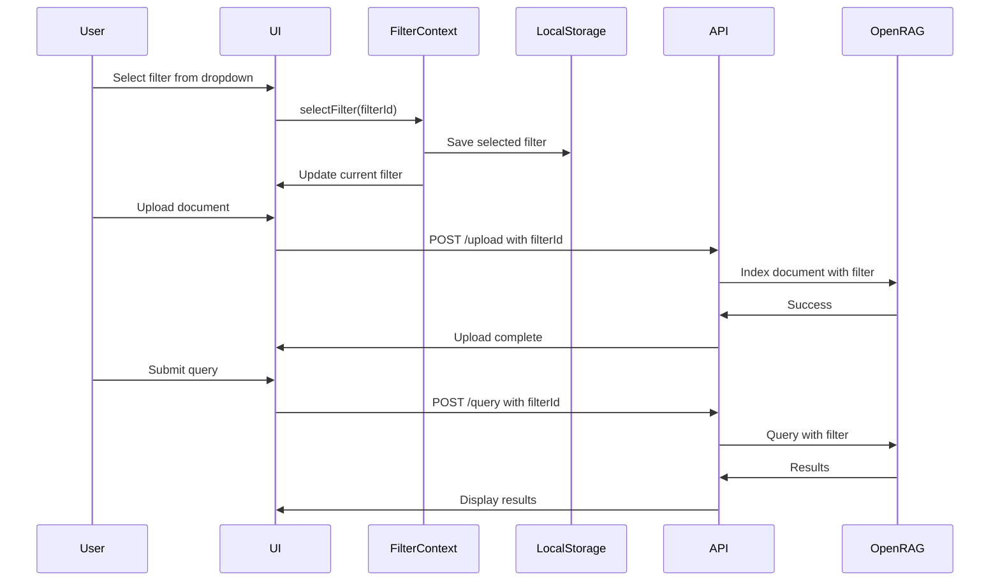
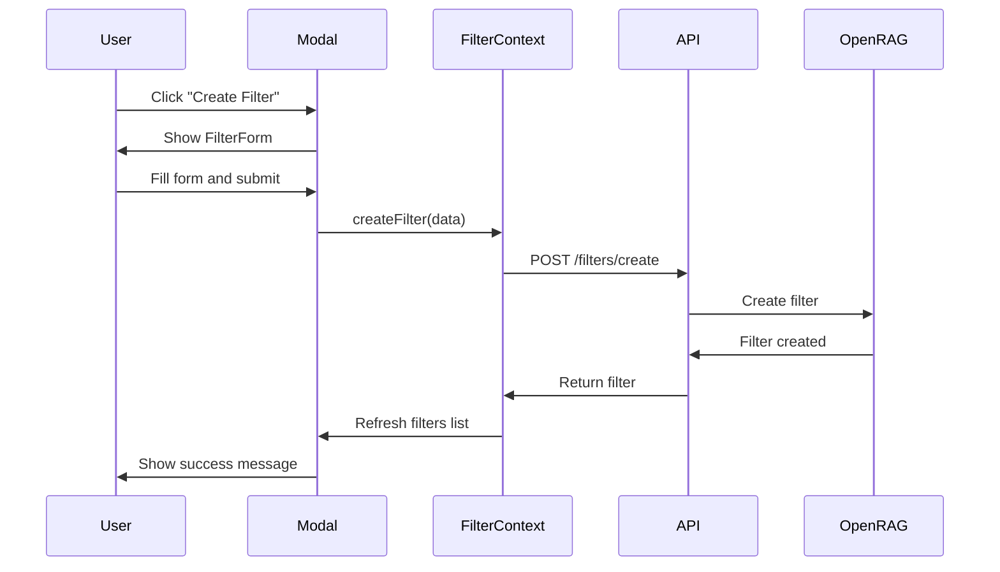

# Visual OpenRAG Filter Management - Technical Specification

## Executive Summary

This specification details the implementation of visual filter management for OpenRAG, replacing the hardcoded "Compare" filter with a user-friendly UI that allows creating, selecting, and managing multiple knowledge filters for both document ingestion and querying phases.

**Key Changes:**
- Replace hardcoded `KNOWLEDGE_FILTER_ID = 'Compare'` with dynamic filter selection
- Add global configuration bar with model and filter selectors
- Implement filter CRUD operations via UI
- Persist filter preferences in localStorage
- Maintain backward compatibility with existing "Compare" filter

---

## 1. Architecture Overview

### 1.1 System Architecture

```
┌─────────────────────────────────────────────────────────────┐
│                      Page Header                            │
│                 (Title + Description)                       │
└─────────────────────────────────────────────────────────────┘
┌─────────────────────────────────────────────────────────────┐
│              GlobalConfigBar Component                      │
│  ┌──────────────┐  ┌──────────────┐  ┌──────────────┐     │
│  │ Model        │  │ Filter       │  │ Actions      │     │
│  │ Selector     │  │ Selector     │  │ [+ Filter]   │     │
│  └──────────────┘  └──────────────┘  └──────────────┘     │
└─────────────────────────────────────────────────────────────┘
┌─────────────────────────────────────────────────────────────┐
│                    Tab Navigation                           │
│         [Ingest] [Query] [Charts] [Performance]            │
└─────────────────────────────────────────────────────────────┘
┌─────────────────────────────────────────────────────────────┐
│                     Tab Content                             │
│                  (Active Tab Panel)                         │
└─────────────────────────────────────────────────────────────┘
```

### 1.2 Data Flow

```
User Action (Select Filter)
    ↓
FilterContext.setCurrentFilter()
    ↓
localStorage.setItem('selectedFilter')
    ↓
┌─────────────────────────────────────┐
│  Ingest Phase                       │
│  - Pass filterId to upload API      │
│  - API uses filterId in indexing    │
└─────────────────────────────────────┘
┌─────────────────────────────────────┐
│  Query Phase                        │
│  - Pass filterId to query API       │
│  - API uses filterId in retrieval   │
└─────────────────────────────────────┘
```

### 1.3 Component Hierarchy

```
page.tsx
├── GlobalConfigBar
│   ├── ModelSelector (existing, moved from IngestTab)
│   ├── FilterSelector (new)
│   └── FilterManagementButton (new)
├── TabContainer
│   ├── IngestTab (modified - remove ModelConfigSection)
│   │   └── DocumentUpload (modified - use filter from context)
│   ├── QueryTab (modified - use filter from context)
│   ├── PerformanceTab (unchanged)
│   └── ChartsTab (unchanged)
└── FilterManagementModal (new)
    └── FilterForm (new)
```

---

## 2. Type Definitions

### 2.1 Filter Types (`src/types/filter-management.ts`)

```typescript
/**
 * OpenRAG Knowledge Filter Configuration
 */
export interface FilterConfig {
  /** Unique filter identifier from OpenRAG */
  id: string;
  /** User-friendly filter name */
  name: string;
  /** Optional description */
  description?: string;
  /** Query configuration */
  queryData: {
    /** Number of chunks to retrieve */
    limit: number;
    /** Minimum relevance score threshold (0-1) */
    scoreThreshold: number;
    /** Filters object */
    filters: {
      /** Array of document filenames to filter by */
      data_sources: string[];
    };
  };
  /** Creation timestamp */
  createdAt?: Date;
  /** Last modified timestamp */
  updatedAt?: Date;
}

/**
 * Filter selector component props
 */
export interface FilterSelectorProps {
  /** Currently selected filter ID */
  currentFilter: string | null;
  /** Array of available filters */
  availableFilters: FilterConfig[];
  /** Callback when filter selection changes */
  onFilterChange: (filterId: string) => void;
  /** Whether the selector is disabled */
  disabled?: boolean;
  /** Whether filters are being loaded */
  isLoading?: boolean;
  /** Callback to open filter management modal */
  onManageFilters: () => void;
}

/**
 * Filter form data for create/edit operations
 */
export interface FilterFormData {
  /** Filter name (required) */
  name: string;
  /** Filter description (optional) */
  description?: string;
  /** Number of chunks to retrieve (default: 5) */
  limit: number;
  /** Minimum relevance score (default: 0.5) */
  scoreThreshold: number;
}

/**
 * Filter management modal props
 */
export interface FilterManagementModalProps {
  /** Whether modal is open */
  isOpen: boolean;
  /** Callback to close modal */
  onClose: () => void;
  /** Current filters list */
  filters: FilterConfig[];
  /** Callback when filters are updated */
  onFiltersUpdated: () => void;
  /** Currently selected filter ID */
  currentFilterId: string | null;
}

/**
 * Filter context state
 */
export interface FilterContextState {
  /** Currently selected filter */
  currentFilter: FilterConfig | null;
  /** All available filters */
  availableFilters: FilterConfig[];
  /** Whether filters are being loaded */
  isLoading: boolean;
  /** Error message if any */
  error: string | null;
  /** Select a filter by ID */
  selectFilter: (filterId: string) => Promise<void>;
  /** Refresh filters list from OpenRAG */
  refreshFilters: () => Promise<void>;
  /** Create a new filter */
  createFilter: (data: FilterFormData) => Promise<FilterConfig>;
  /** Update an existing filter */
  updateFilter: (filterId: string, data: Partial<FilterFormData>) => Promise<void>;
  /** Delete a filter */
  deleteFilter: (filterId: string) => Promise<void>;
}
```

### 2.2 API Types

```typescript
/**
 * Request to create a new filter
 */
export interface CreateFilterRequest {
  name: string;
  description?: string;
  limit: number;
  scoreThreshold: number;
}

/**
 * Response from filter creation
 */
export interface CreateFilterResponse {
  success: boolean;
  filter?: FilterConfig;
  error?: string;
}

/**
 * Request to list all filters
 */
export interface ListFiltersRequest {
  // No parameters needed - lists all filters
}

/**
 * Response from listing filters
 */
export interface ListFiltersResponse {
  success: boolean;
  filters: FilterConfig[];
  error?: string;
}

/**
 * Request to update a filter
 */
export interface UpdateFilterRequest {
  filterId: string;
  name?: string;
  description?: string;
  limit?: number;
  scoreThreshold?: number;
  dataSources?: string[];
}

/**
 * Response from filter update
 */
export interface UpdateFilterResponse {
  success: boolean;
  filter?: FilterConfig;
  error?: string;
}

/**
 * Request to delete a filter
 */
export interface DeleteFilterRequest {
  filterId: string;
}

/**
 * Response from filter deletion
 */
export interface DeleteFilterResponse {
  success: boolean;
  error?: string;
}
```

---

## 3. State Management

### 3.1 Filter Context (`src/contexts/FilterContext.tsx`)

```typescript
import { createContext, useContext, useState, useEffect, ReactNode } from 'react';
import type { FilterConfig, FilterContextState, FilterFormData } from '@/types/filter-management';

const FilterContext = createContext<FilterContextState | undefined>(undefined);

export function FilterProvider({ children }: { children: ReactNode }) {
  const [currentFilter, setCurrentFilter] = useState<FilterConfig | null>(null);
  const [availableFilters, setAvailableFilters] = useState<FilterConfig[]>([]);
  const [isLoading, setIsLoading] = useState(false);
  const [error, setError] = useState<string | null>(null);

  // Load filters on mount
  useEffect(() => {
    refreshFilters();
    loadSavedFilter();
  }, []);

  // Load saved filter from localStorage
  const loadSavedFilter = () => {
    const savedFilterId = localStorage.getItem('selectedFilterId');
    if (savedFilterId && availableFilters.length > 0) {
      const filter = availableFilters.find(f => f.id === savedFilterId);
      if (filter) {
        setCurrentFilter(filter);
      }
    }
  };

  // Fetch all filters from OpenRAG
  const refreshFilters = async () => {
    setIsLoading(true);
    setError(null);
    try {
      const response = await fetch('/api/filters/list');
      const data = await response.json();
      
      if (data.success) {
        setAvailableFilters(data.filters);
        
        // If no current filter, select first one or "Compare" if it exists
        if (!currentFilter && data.filters.length > 0) {
          const compareFilter = data.filters.find((f: FilterConfig) => f.name === 'Compare');
          setCurrentFilter(compareFilter || data.filters[0]);
        }
      } else {
        setError(data.error || 'Failed to load filters');
      }
    } catch (err) {
      setError(err instanceof Error ? err.message : 'Failed to load filters');
    } finally {
      setIsLoading(false);
    }
  };

  // Select a filter
  const selectFilter = async (filterId: string) => {
    const filter = availableFilters.find(f => f.id === filterId);
    if (filter) {
      setCurrentFilter(filter);
      localStorage.setItem('selectedFilterId', filterId);
    }
  };

  // Create a new filter
  const createFilter = async (data: FilterFormData): Promise<FilterConfig> => {
    const response = await fetch('/api/filters/create', {
      method: 'POST',
      headers: { 'Content-Type': 'application/json' },
      body: JSON.stringify(data),
    });
    
    const result = await response.json();
    
    if (!result.success || !result.filter) {
      throw new Error(result.error || 'Failed to create filter');
    }
    
    await refreshFilters();
    return result.filter;
  };

  // Update an existing filter
  const updateFilter = async (filterId: string, data: Partial<FilterFormData>) => {
    const response = await fetch('/api/filters/update', {
      method: 'PUT',
      headers: { 'Content-Type': 'application/json' },
      body: JSON.stringify({ filterId, ...data }),
    });
    
    const result = await response.json();
    
    if (!result.success) {
      throw new Error(result.error || 'Failed to update filter');
    }
    
    await refreshFilters();
  };

  // Delete a filter
  const deleteFilter = async (filterId: string) => {
    const response = await fetch('/api/filters/delete', {
      method: 'DELETE',
      headers: { 'Content-Type': 'application/json' },
      body: JSON.stringify({ filterId }),
    });
    
    const result = await response.json();
    
    if (!result.success) {
      throw new Error(result.error || 'Failed to delete filter');
    }
    
    // If deleted filter was selected, select another one
    if (currentFilter?.id === filterId) {
      await refreshFilters();
      if (availableFilters.length > 0) {
        setCurrentFilter(availableFilters[0]);
      } else {
        setCurrentFilter(null);
      }
    } else {
      await refreshFilters();
    }
  };

  return (
    <FilterContext.Provider
      value={{
        currentFilter,
        availableFilters,
        isLoading,
        error,
        selectFilter,
        refreshFilters,
        createFilter,
        updateFilter,
        deleteFilter,
      }}
    >
      {children}
    </FilterContext.Provider>
  );
}

export function useFilter() {
  const context = useContext(FilterContext);
  if (!context) {
    throw new Error('useFilter must be used within FilterProvider');
  }
  return context;
}
```

---

## 4. Component Specifications

### 4.1 GlobalConfigBar Component

**File:** `src/components/config/GlobalConfigBar.tsx`

**Purpose:** Container for global configuration controls (model + filter selectors)

**Props:**
```typescript
interface GlobalConfigBarProps {
  // Model selector props
  ollamaModel: string;
  onOllamaModelChange: (model: string) => void;
  isOllamaAvailable: boolean;
  availableOllamaModels: OllamaModelInfo[];
}
```

**Layout:**
- 3-column grid on large screens
- Stacks vertically on mobile
- Sticky positioning (optional)
- Matches existing design system (Unkey-inspired)

**Implementation Notes:**
- Uses existing `ModelSelector` component (moved from `ModelConfigSection`)
- Integrates new `FilterSelector` component
- Includes "Manage Filters" button to open modal

---

### 4.2 FilterSelector Component

**File:** `src/components/ui/FilterSelector.tsx`

**Purpose:** Dropdown to select active knowledge filter

**Props:** See `FilterSelectorProps` in type definitions

**Features:**
- Dropdown list of available filters
- Shows filter name and description (tooltip)
- Displays current filter's settings (limit, scoreThreshold)
- "Manage Filters" button to open management modal
- Loading state while fetching filters
- Error state if filters fail to load

**UI Design:**
```
┌─────────────────────────────────────┐
│ Knowledge Filter                    │
│ ┌─────────────────────────────────┐ │
│ │ Compare                      ▼  │ │
│ └─────────────────────────────────┘ │
│ Limit: 5 | Threshold: 0.5          │
│ [Manage Filters]                    │
└─────────────────────────────────────┘
```

---

### 4.3 FilterManagementModal Component

**File:** `src/components/filters/FilterManagementModal.tsx`

**Purpose:** Modal dialog for CRUD operations on filters

**Features:**
- List all filters with edit/delete actions
- Create new filter button
- Edit filter inline or in form
- Delete confirmation
- Shows filter details (name, description, settings, data sources)

**UI Design:**
```
┌──────────────────────────────────────────────┐
│ Manage Knowledge Filters              [X]   │
├──────────────────────────────────────────────┤
│ [+ Create New Filter]                        │
│                                              │
│ ┌──────────────────────────────────────────┐ │
│ │ Compare                          [Edit]  │ │
│ │ Filter for document comparison   [Delete]│ │
│ │ Limit: 5 | Threshold: 0.5               │ │
│ │ Data Sources: 3 files                   │ │
│ └──────────────────────────────────────────┘ │
│                                              │
│ ┌──────────────────────────────────────────┐ │
│ │ Research Papers                  [Edit]  │ │
│ │ Academic research documents      [Delete]│ │
│ │ Limit: 10 | Threshold: 0.7              │ │
│ │ Data Sources: 12 files                  │ │
│ └──────────────────────────────────────────┘ │
│                                              │
│                                 [Close]      │
└──────────────────────────────────────────────┘
```

---

### 4.4 FilterForm Component

**File:** `src/components/filters/FilterForm.tsx`

**Purpose:** Form for creating/editing filter configuration

**Props:**
```typescript
interface FilterFormProps {
  /** Existing filter to edit (null for create) */
  filter?: FilterConfig | null;
  /** Callback when form is submitted */
  onSubmit: (data: FilterFormData) => Promise<void>;
  /** Callback when form is cancelled */
  onCancel: () => void;
  /** Whether form is submitting */
  isSubmitting?: boolean;
}
```

**Fields:**
- Name (required, text input)
- Description (optional, textarea)
- Limit (required, number input, default: 5)
- Score Threshold (required, number input 0-1, default: 0.5)

**Validation:**
- Name: 1-50 characters, alphanumeric + spaces/hyphens
- Limit: 1-50
- Score Threshold: 0.0-1.0

---

## 5. API Endpoints

### 5.1 List Filters

**Endpoint:** `GET /api/filters/list`

**Purpose:** Retrieve all knowledge filters from OpenRAG

**Response:**
```typescript
{
  success: boolean;
  filters: FilterConfig[];
  error?: string;
}
```

**Implementation:**
```typescript
// src/app/api/filters/list/route.ts
import { NextResponse } from 'next/server';
import { getOpenRAGClient } from '@/lib/rag-comparison/utils/pipeline-utils';

export async function GET() {
  try {
    const client = getOpenRAGClient();
    
    // Search for all filters (empty query returns all)
    const filters = await client.knowledgeFilters.search('', 100);
    
    return NextResponse.json({
      success: true,
      filters: filters || [],
    });
  } catch (error) {
    console.error('Failed to list filters:', error);
    return NextResponse.json(
      {
        success: false,
        filters: [],
        error: error instanceof Error ? error.message : 'Failed to list filters',
      },
      { status: 500 }
    );
  }
}
```

---

### 5.2 Create Filter

**Endpoint:** `POST /api/filters/create`

**Request Body:**
```typescript
{
  name: string;
  description?: string;
  limit: number;
  scoreThreshold: number;
}
```

**Response:**
```typescript
{
  success: boolean;
  filter?: FilterConfig;
  error?: string;
}
```

**Implementation:**
```typescript
// src/app/api/filters/create/route.ts
import { NextRequest, NextResponse } from 'next/server';
import { getOpenRAGClient } from '@/lib/rag-comparison/utils/pipeline-utils';

export async function POST(request: NextRequest) {
  try {
    const body = await request.json();
    const { name, description, limit, scoreThreshold } = body;
    
    // Validation
    if (!name || typeof name !== 'string' || name.length === 0) {
      return NextResponse.json(
        { success: false, error: 'Filter name is required' },
        { status: 400 }
      );
    }
    
    if (limit < 1 || limit > 50) {
      return NextResponse.json(
        { success: false, error: 'Limit must be between 1 and 50' },
        { status: 400 }
      );
    }
    
    if (scoreThreshold < 0 || scoreThreshold > 1) {
      return NextResponse.json(
        { success: false, error: 'Score threshold must be between 0 and 1' },
        { status: 400 }
      );
    }
    
    const client = getOpenRAGClient();
    
    // Create filter with empty data_sources (will be populated during ingestion)
    const result = await client.knowledgeFilters.create({
      name,
      description: description || `Filter: ${name}`,
      queryData: {
        limit,
        scoreThreshold,
        filters: {
          data_sources: [], // Start empty
        },
      },
    });
    
    if (!result.success || !result.id) {
      throw new Error('Failed to create filter');
    }
    
    // Fetch the created filter to return full details
    const createdFilter = await client.knowledgeFilters.get(result.id);
    
    return NextResponse.json({
      success: true,
      filter: createdFilter,
    });
  } catch (error) {
    console.error('Failed to create filter:', error);
    return NextResponse.json(
      {
        success: false,
        error: error instanceof Error ? error.message : 'Failed to create filter',
      },
      { status: 500 }
    );
  }
}
```

---

### 5.3 Update Filter

**Endpoint:** `PUT /api/filters/update`

**Request Body:**
```typescript
{
  filterId: string;
  name?: string;
  description?: string;
  limit?: number;
  scoreThreshold?: number;
  dataSources?: string[];
}
```

**Response:**
```typescript
{
  success: boolean;
  filter?: FilterConfig;
  error?: string;
}
```

---

### 5.4 Delete Filter

**Endpoint:** `DELETE /api/filters/delete`

**Request Body:**
```typescript
{
  filterId: string;
}
```

**Response:**
```typescript
{
  success: boolean;
  error?: string;
}
```

---

## 6. Integration Points

### 6.1 Update `page.tsx`

**Changes:**
1. Wrap app in `FilterProvider`
2. Add `GlobalConfigBar` between header and tabs
3. Remove Ollama model state (move to GlobalConfigBar)

**Modified Structure:**
```tsx
<FilterProvider>
  <MetricsTabProvider>
    <div className="min-h-screen bg-unkey-black">
      {/* Header */}
      <header>...</header>
      
      {/* NEW: Global Config Bar */}
      <GlobalConfigBar
        ollamaModel={ollamaModel}
        onOllamaModelChange={setOllamaModel}
        isOllamaAvailable={isOllamaAvailable}
        availableOllamaModels={availableOllamaModels}
      />
      
      {/* Tabs */}
      <TabContainer>...</TabContainer>
    </div>
  </MetricsTabProvider>
</FilterProvider>
```

---

### 6.2 Update `rag-pipeline.ts`

**Changes:**
1. Remove `KNOWLEDGE_FILTER_ID` constant
2. Update `createKnowledgeFilter()` to accept filter ID parameter
3. Update `indexDocument()` to require filter ID
4. Update `query()` to accept filter ID parameter

**Key Modifications:**

```typescript
// REMOVE THIS:
const KNOWLEDGE_FILTER_ID = 'Compare';

// UPDATE createKnowledgeFilter signature:
export async function createKnowledgeFilter(
  documentId: string,
  filename: string,
  filterId: string // NEW: Accept filter ID
): Promise<string> {
  // Use provided filterId instead of hardcoded constant
  // ...
}

// UPDATE query signature:
export async function query(
  documentId: string,
  query: string,
  config: RAGConfig,
  filterId: string, // NEW: Accept filter ID
  eventCallback?: (event: ProcessingEvent) => void
): Promise<RAGResult> {
  // Use provided filterId instead of searching for "Compare"
  // ...
}
```

---

### 6.3 Update `IngestTab.tsx`

**Changes:**
1. Remove `ModelConfigSection` import and usage
2. Use `useFilter()` hook to get current filter
3. Pass filter ID to upload API

**Modified Code:**
```tsx
import { useFilter } from '@/contexts/FilterContext';

export function IngestTab(props: IngestTabProps) {
  const { currentFilter } = useFilter();
  
  // Pass filterId to DocumentUpload
  return (
    <div className="grid grid-cols-1 gap-6">
      <DocumentUpload
        onUploadComplete={props.onUploadComplete}
        onUploadResult={props.onUploadResult}
        onUploadStart={props.onUploadStart}
        onStreamingProgressChange={props.onStreamingProgressChange}
        filterId={currentFilter?.id} // NEW: Pass filter ID
      />
      {/* Remove ModelConfigSection */}
    </div>
  );
}
```

---

### 6.4 Update `QueryTab.tsx`

**Changes:**
1. Use `useFilter()` hook to get current filter
2. Pass filter ID to query API

**Modified Code:**
```tsx
import { useFilter } from '@/contexts/FilterContext';

export function QueryTab(props: QueryTabProps) {
  const { currentFilter } = useFilter();
  
  const handleSubmit = async (query: string, temperature: number, maxTokens: number) => {
    await props.onQueryBoth(query, temperature, maxTokens, currentFilter?.id);
  };
  
  // ...
}
```

---

### 6.5 Update Upload API Route

**File:** `src/app/api/rag-comparison/upload-stream/route.ts`

**Changes:**
1. Accept `filterId` in request body
2. Pass `filterId` to `indexDocument()`

**Modified Code:**
```typescript
export async function POST(request: NextRequest) {
  // ...
  const { filterId } = await request.json(); // NEW: Get filter ID
  
  // Pass filterId to indexDocument
  const ragResult = await indexDocument(
    file,
    documentId,
    metadata,
    filterId // NEW: Pass filter ID
  );
  // ...
}
```

---

### 6.6 Update Query API Route

**File:** `src/app/api/rag-comparison/query/route.ts`

**Changes:**
1. Accept `filterId` in request body
2. Pass `filterId` to `query()`

**Modified Code:**
```typescript
export async function POST(request: NextRequest) {
  // ...
  const { filterId } = await request.json(); // NEW: Get filter ID
  
  // Pass filterId to query
  const ragResult = await query(
    documentId,
    queryText,
    ragConfig,
    filterId // NEW: Pass filter ID
  );
  // ...
}
```

---

## 7. Migration Strategy

### 7.1 Backward Compatibility

**Approach:** Maintain "Compare" filter as default

**Steps:**
1. On first load, check if "Compare" filter exists
2. If not, create it automatically with default settings
3. Set as default selected filter
4. Store in localStorage for future sessions

**Implementation:**
```typescript
// In FilterProvider useEffect
useEffect(() => {
  async function initializeFilters() {
    await refreshFilters();
    
    // Check if "Compare" filter exists
    const compareFilter = availableFilters.find(f => f.name === 'Compare');
    
    if (!compareFilter) {
      // Create default "Compare" filter
      await createFilter({
        name: 'Compare',
        description: 'Default filter for document comparison',
        limit: 5,
        scoreThreshold: 0.5,
      });
    }
    
    // Load saved filter or use "Compare" as default
    loadSavedFilter();
  }
  
  initializeFilters();
}, []);
```

---

### 7.2 Data Migration

**No data migration needed** - existing documents and filters in OpenRAG remain unchanged.

**Considerations:**
- Existing "Compare" filter will continue to work
- Users can create new filters alongside "Compare"
- No breaking changes to existing functionality

---

## 8. User Experience Flows

### 8.1 Creating a New Filter

1. User clicks "Manage Filters" button in GlobalConfigBar
2. FilterManagementModal opens
3. User clicks "+ Create New Filter"
4. FilterForm appears with empty fields
5. User fills in:
   - Name: "Research Papers"
   - Description: "Academic research documents"
   - Limit: 10
   - Score Threshold: 0.7
6. User clicks "Create"
7. API creates filter in OpenRAG
8. Modal refreshes to show new filter
9. User can select new filter from dropdown

---

### 8.2 Selecting a Filter for Ingest

1. User selects filter from GlobalConfigBar dropdown
2. Filter selection is saved to localStorage
3. User uploads document(s) in Ingest tab
4. Upload API receives selected filter ID
5. Documents are associated with selected filter
6. Filter's `data_sources` array is updated with new filenames

---

### 8.3 Selecting a Filter for Query

1. User selects filter from GlobalConfigBar dropdown
2. Filter selection is saved to localStorage
3. User enters query in Query tab
4. Query API receives selected filter ID
5. RAG retrieval is scoped to filter's `data_sources`
6. Results show chunks only from filtered documents

---

### 8.4 Editing a Filter

1. User opens FilterManagementModal
2. User clicks "Edit" on a filter
3. FilterForm appears pre-filled with current values
4. User modifies settings (e.g., increase limit to 15)
5. User clicks "Save"
6. API updates filter in OpenRAG
7. Modal refreshes to show updated filter
8. If filter was selected, UI reflects new settings

---

### 8.5 Deleting a Filter

1. User opens FilterManagementModal
2. User clicks "Delete" on a filter
3. Confirmation dialog appears: "Are you sure? This will not delete associated documents."
4. User confirms deletion
5. API deletes filter from OpenRAG
6. If deleted filter was selected, UI switches to first available filter
7. Modal refreshes to show remaining filters

---

## 9. Testing Considerations

### 9.1 Unit Tests

**Filter Context:**
- Test filter selection
- Test filter creation
- Test filter update
- Test filter deletion
- Test localStorage persistence
- Test error handling

**Components:**
- FilterSelector renders correctly
- FilterManagementModal CRUD operations
- FilterForm validation

---

### 9.2 Integration Tests

**Upload Flow:**
- Document upload with selected filter
- Multi-file upload with filter
- Filter's data_sources updated correctly

**Query Flow:**
- Query with selected filter
- Results scoped to filter's documents
- Switching filters between queries

---

### 9.3 E2E Tests

**Complete Workflow:**
1. Create new filter
2. Upload documents with filter
3. Query documents with filter
4. Verify results are scoped correctly
5. Switch to different filter
6. Verify results change appropriately

---

## 10. Implementation Sequence

### Phase 1: Foundation (Days 1-2)
1. ✅ Create type definitions (`filter-management.ts`)
2. ✅ Create FilterContext and provider
3. ✅ Create API endpoints (list, create, update, delete)
4. ✅ Test API endpoints with Postman/curl

### Phase 2: UI Components (Days 3-4)
5. ✅ Create FilterSelector component
6. ✅ Create FilterManagementModal component
7. ✅ Create FilterForm component
8. ✅ Create GlobalConfigBar component
9. ✅ Test components in isolation

### Phase 3: Integration (Days 5-6)
10. ✅ Update `page.tsx` with FilterProvider and GlobalConfigBar
11. ✅ Update `IngestTab.tsx` to use filter context
12. ✅ Update `QueryTab.tsx` to use filter context
13. ✅ Update upload API route to accept filterId
14. ✅ Update query API route to accept filterId

### Phase 4: Pipeline Updates (Day 7)
15. ✅ Update `rag-pipeline.ts` to use dynamic filters
16. ✅ Update `hybrid-pipeline.ts` to use dynamic filters
17. ✅ Remove hardcoded KNOWLEDGE_FILTER_ID constant
18. ✅ Test end-to-end flow

### Phase 5: Polish & Testing (Days 8-9)
19. ✅ Add loading states and error handling
20. ✅ Implement localStorage persistence
21. ✅ Add backward compatibility for "Compare" filter
22. ✅ Write unit tests
23. ✅ Write integration tests
24. ✅ Perform E2E testing

### Phase 6: Documentation (Day 10)
25. ✅ Update README with filter management instructions
26. ✅ Create user guide for filter management
27. ✅ Document API endpoints
28. ✅ Update architecture diagrams

---

## 11. Success Criteria

### Functional Requirements
- ✅ Users can create new filters via UI
- ✅ Users can select filters for ingest and query
- ✅ Users can edit filter settings
- ✅ Users can delete filters
- ✅ Filter selection persists across sessions
- ✅ Documents are correctly associated with selected filter
- ✅ Queries are correctly scoped to selected filter

### Non-Functional Requirements
- ✅ UI is responsive and accessible
- ✅ Filter operations complete within 2 seconds
- ✅ No breaking changes to existing functionality
- ✅ Backward compatible with "Compare" filter
- ✅ Error messages are clear and actionable
- ✅ Code follows existing patterns and conventions

---

## 12. Future Enhancements

### Phase 2 Features (Post-MVP)
1. **Filter Templates:** Pre-configured filters for common use cases
2. **Filter Sharing:** Export/import filter configurations
3. **Advanced Filtering:** Filter by document type, date range, metadata
4. **Filter Analytics:** Show usage statistics per filter
5. **Bulk Operations:** Apply filter to multiple documents at once
6. **Filter Presets:** Quick-select filters for different projects
7. **Filter Versioning:** Track changes to filter configurations
8. **Smart Filters:** Auto-suggest filters based on document content

---

## Appendix A: Mermaid Diagrams

### Filter Selection Flow



### Filter CRUD Operations



---

## Appendix B: Code Snippets

### Example: Using Filter in Component

```typescript
import { useFilter } from '@/contexts/FilterContext';

function MyComponent() {
  const { currentFilter, selectFilter, availableFilters } = useFilter();
  
  return (
    <div>
      <h2>Current Filter: {currentFilter?.name}</h2>
      <select 
        value={currentFilter?.id || ''} 
        onChange={(e) => selectFilter(e.target.value)}
      >
        {availableFilters.map(filter => (
          <option key={filter.id} value={filter.id}>
            {filter.name}
          </option>
        ))}
      </select>
    </div>
  );
}
```

---

## Appendix C: Design Mockups

### GlobalConfigBar Layout

```
┌────────────────────────────────────────────────────────────────┐
│                     Global Configuration                       │
├────────────────────────────────────────────────────────────────┤
│  ┌──────────────────┐  ┌──────────────────┐  ┌──────────────┐ │
│  │ Ollama Model     │  │ Knowledge Filter │  │ Actions      │ │
│  │ ┌──────────────┐ │  │ ┌──────────────┐ │  │ ┌──────────┐ │ │
│  │ │ llama3.2  ▼  │ │  │ │ Compare   ▼  │ │  │ │+ Filter  │ │ │
│  │ └──────────────┘ │  │ └──────────────┘ │  │ └──────────┘ │ │
│  │ Status: ✅       │  │ Limit: 5         │  │              │ │
│  │                  │  │ Threshold: 0.5   │  │              │ │
│  └──────────────────┘  └──────────────────┘  └──────────────┘ │
└────────────────────────────────────────────────────────────────┘
```

---

## Document Metadata

- **Version:** 1.0
- **Author:** Bob (Plan Mode)
- **Date:** 2026-03-27
- **Status:** Draft for Review
- **Estimated Implementation Time:** 10 days
- **Complexity:** Medium-High

---

**End of Specification**